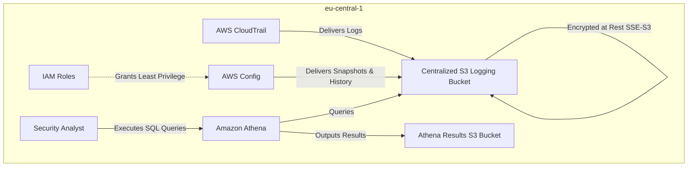
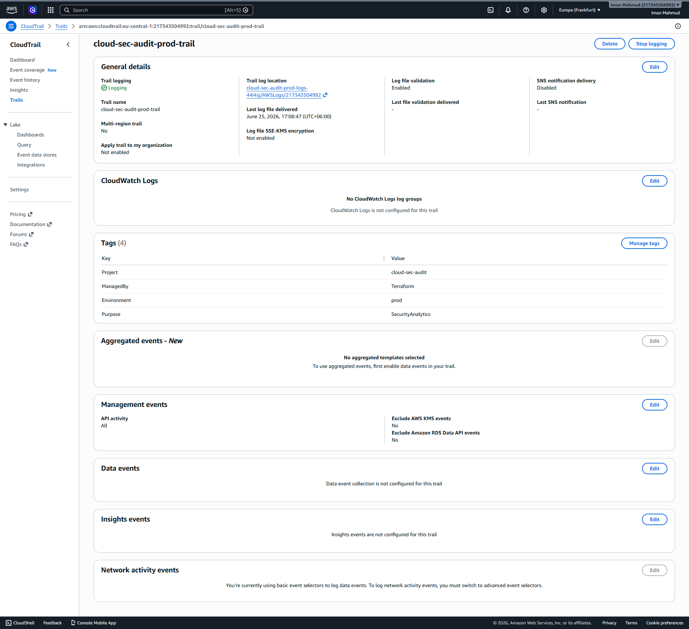
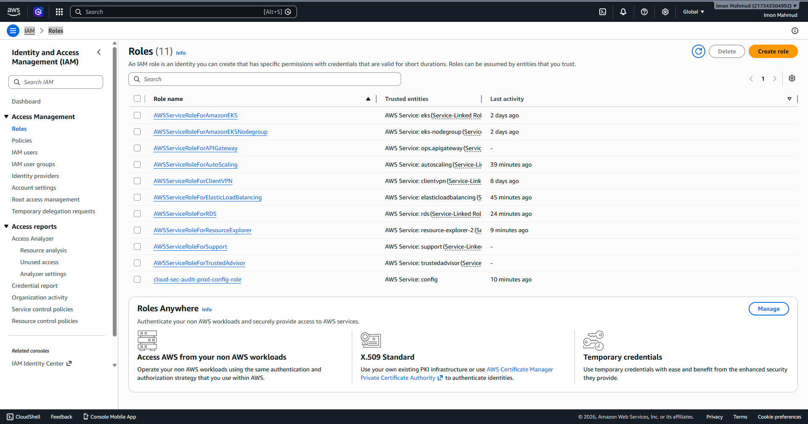

# Centralized Cloud Audit, Governance & Security Analytics Platform


## 📌 Project Overview
This repository contains a production-grade Infrastructure as Code (IaC) deployment for a centralized AWS security and audit logging platform. Designed for enterprise environments, it automates the collection of management events and configuration changes across an AWS environment and provides serverless, SQL-based security analytics capabilities.

The infrastructure strict adheres to the AWS Well-Architected Framework and the principle of least privilege, providing a robust solution for compliance, governance, and cloud security posture management.

## 🏗️ Architecture Overview



## 🛠️ Technology Stack
* **Cloud Provider**: Amazon Web Services (AWS)
* **Infrastructure as Code**: Terraform (HCL)
* **AWS Services**:
  * **AWS CloudTrail**: For API auditing and tracking user activity.
  * **AWS Config**: For continuous resource tracking and configuration history.
  * **Amazon S3**: For secure, encrypted, and centralized log storage.
  * **Amazon Athena**: For serverless SQL querying of audit logs.
  * **AWS IAM**: For implementing strict least-privilege security controls.

## 🚀 Features

### Security Features
* **Centralized Secure Storage**: All logs are aggregated into a tightly controlled S3 bucket.
* **Encryption at Rest**: S3 default encryption (SSE-S3) is enforced for both logging and Athena results.
* **Public Access Block**: S3 Public Access is strictly blocked at the bucket level.
* **Least Privilege IAM**: Custom IAM roles and bucket policies limit write access to only explicitly authorized AWS service principals (`cloudtrail.amazonaws.com` and `config.amazonaws.com`).

### Governance Features
* **Complete Audit Trail**: Captures global AWS management events.
* **Configuration Tracking**: AWS Config tracks all supported regional and global resources.
* **Automated Data Retention**: S3 Lifecycle rules automatically expire and delete logs after a defined retention period to minimize costs.

### Cost Optimization
* **Serverless Analytics**: Amazon Athena charges only per query scanned, with zero infrastructure to manage.
* **Free-Tier Compatibility**: Designed carefully to operate within AWS Free Tier limits (single-region trail, optimized storage).

## 📁 Terraform Project Structure
```text
.
├── providers.tf         # AWS provider and region configuration
├── versions.tf          # Terraform and provider versions
├── variables.tf         # Input variables (environment, project names, etc.)
├── outputs.tf           # Output values (ARNs, bucket names)
├── locals.tf            # Naming conventions and standard tagging
├── main.tf              # Current caller identity and random suffixes
├── s3.tf                # S3 buckets, encryption, PAB, lifecycle, and bucket policies
├── iam.tf               # IAM roles and policies for AWS Config
├── cloudtrail.tf        # Regional CloudTrail configuration
├── config.tf            # AWS Config Recorder and Delivery Channel
├── athena.tf            # Athena Workgroup, Database, and results storage
├── .gitignore           # Standard Terraform git ignores
└── test_aws.py          # Python script for generating events and testing Athena
```

## 📸 Screenshots Gallery

The following screenshots demonstrate the deployed resources and successful validation:

1. **S3 Logging Bucket Configuration**  
   

2. **S3 Bucket Policy & Permissions**  
   

3. **CloudTrail Configuration**  
   
   
4. **CloudTrail Event History**  
   

5. **AWS Config Dashboard**  
   

6. **IAM Role (Least Privilege)**  
   

7. **Amazon Athena Query Editor**  
   

## ⚙️ Deployment Process

1. **Initialize Terraform**: Downloads providers and initializes the backend.
   ```bash
   terraform init
   ```
2. **Validate Configuration**: Ensures the code is syntactically valid.
   ```bash
   terraform validate
   ```
3. **Plan Deployment**: Previews the resources that will be created.
   ```bash
   terraform plan
   ```
4. **Apply Infrastructure**: Deploys the infrastructure to the AWS account.
   ```bash
   terraform apply -auto-approve
   ```

## ✅ Validation & Testing Process
A custom python script (`test_aws.py`) was used to validate the entire pipeline:
1. **Event Generation**: Automatically created and deleted an IAM user to trigger CloudTrail management events.
2. **Athena Table Creation**: Created the `cloudtrail_logs` external table pointing to the S3 bucket via Athena SQL.
3. **Analytics Query Execution**: Executed a `SELECT` query against the CloudTrail logs successfully, validating the data pipeline from event generation -> S3 storage -> Athena analytics.

## 🧹 Infrastructure Lifecycle & Cleanup Process
To prevent unwanted AWS charges and adhere to the project's temporary lifecycle requirements, the infrastructure is completely destroyed after validation:
```bash
terraform destroy -auto-approve
```

## 🔮 Future Enhancements
* **Multi-Account Logging**: Expand the architecture using AWS Organizations to aggregate logs from multiple accounts into a central security account.
* **AWS KMS Encryption**: Implement Customer Managed Keys (CMKs) for S3 and CloudTrail encryption.
* **Athena Partitioning**: Introduce AWS Glue Crawlers or Lambda functions to automatically partition Athena tables by year, month, and day for performance optimization and cost reduction.
* **Alerting**: Integrate Amazon SNS and CloudWatch Events for real-time alerting on critical security events (e.g., unauthorized access attempts, root account logins).

## 🎓 Recruiter Highlights
* **Skills Demonstrated**: Infrastructure as Code (IaC), Cloud Security Posture Management (CSPM), Identity and Access Management (IAM), Data Analytics, Serverless Architectures, CI/CD Readiness.
* **Learning Outcomes**: Deepened expertise in AWS security services integration, strict least-privilege IAM policy writing, and Terraform state/resource lifecycle management.

---

## 📜 License
This project is licensed under the MIT License - see the [LICENSE](LICENSE) file for details.

## 👨‍💻 Author
**Imon Mahmud**  
*IT SPECIALIST | CLOUD INFRASTRUCTURE & AI AUTOMATION ENGINEER*  
[GitHub Profile](https://github.com/eng-imonmahmud)
